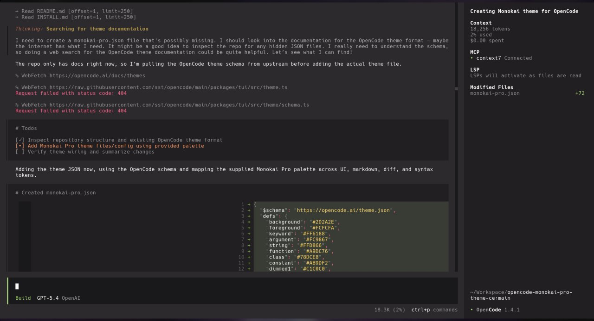

# Monokai Pro (CE) for [OpenCode](https://opencode.ai)

## About this theme

This Monokai Pro Community Edition (CE) theme is maintained by [Relz](https://github.com/Relz) and is based on the original [Monokai Pro](https://monokai.pro) theme.

It brings the classic Monokai Pro palette to OpenCode with a warm charcoal background, bright semantic status colors, and syntax accents tuned for the OpenCode terminal UI.

[Installation instructions](INSTALL.md)

[MIT License](LICENSE.md)

## Monokai Pro for more apps

